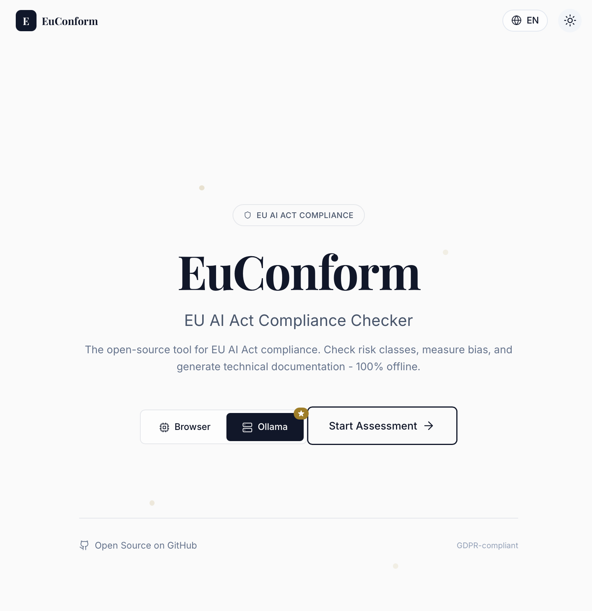

<h1 align="center">EuConform</h1>

<p align="center">
  <strong>🇪🇺 Open-Source EU AI Act Compliance Tool</strong>
</p>

<p align="center">
  Classify risk levels • Detect algorithmic bias • Generate compliance reports<br>
  <em>100% offline • GDPR-by-design • WCAG 2.2 AA accessible</em>
</p>

<p align="center">

  <a href="https://github.com/Hiepler/EuConform/actions/workflows/ci.yml">
    
  </a>
  <a href="https://codecov.io/gh/Hiepler/EuConform">
    
  </a>
  <a href="https://github.com/Hiepler/EuConform/blob/main/LICENSE">
    
  </a>
  <a href="https://github.com/Hiepler/EuConform/blob/main/LICENSE-EUPL">
    
  </a>
</p>

<p align="center">
  
  
  
  <a href="https://biomejs.dev">
    
  </a>
</p>

---

> [!IMPORTANT]
> **Legal Disclaimer**: This tool provides **technical guidance only**. It does **not** constitute legal advice and does **not** replace legally binding conformity assessments by notified bodies or professional legal consultation. Always consult qualified legal professionals for compliance decisions.

---

<p align="center">
  
</p>

<p align="center">

  <a href="#-quick-start"><strong>🚀 Quick Start</strong></a> · 
  <a href="#-documentation"><strong>📖 Docs</strong></a> · 
  <a href="https://vercel.com/new/clone?repository-url=https%3A%2F%2Fgithub.com%2FHiepler%2FEuConform&project-name=euconform&repository-name=euconform"><strong>🌐 Deploy</strong></a> · 
  <a href="https://github.com/Hiepler/EuConform/issues"><strong>🐛 Report Bug</strong></a>
</p>

---

## ✨ Features

| Feature | Description |
|---------|-------------|
| 🎯 **Risk Classification** | Interactive quiz implementing EU AI Act Article 5 (prohibited), Article 6 + Annex III (high-risk) |
| 📊 **Bias Detection** | CrowS-Pairs methodology with log-probability analysis for scientific bias measurement |
| 📄 **PDF Reports** | Generate Annex IV-compliant technical documentation entirely in-browser |
| 🌐 **100% Offline** | All processing happens client-side using transformers.js (WebGPU) |
| 🔒 **Privacy-First** | Zero tracking, no cookies, no external fonts – your data never leaves your browser |
| 🌙 **Dark Mode** | Beautiful glassmorphism design with full dark mode support |
| ♿ **Accessible** | WCAG 2.2 AA compliant with full keyboard navigation |
| 🌍 **Multilingual** | English and German interface |

## 🚀 Quick Start
 
> **Want to try it without installation?** Click the [**🌐 Deploy**](https://vercel.com/new/clone?repository-url=https%3A%2F%2Fgithub.com%2FHiepler%2FEuConform&project-name=euconform&repository-name=euconform) link above to start your own instance on Vercel.


### Prerequisites

- **Node.js** ≥ 18
- **pnpm** ≥ 10 (recommended) or npm/yarn

### Installation

```bash
# Clone the repository
git clone https://github.com/Hiepler/EuConform.git
cd EuConform

# Install dependencies
pnpm install

# Start development server
pnpm dev

# Open http://localhost:3001
```

### Using with Local AI Models (Optional)

For enhanced bias detection with your own models:

1. **Install Ollama**: Download from [ollama.ai](https://ollama.ai)
2. **Pull a model**: `ollama pull llama3.2`
3. **Start Ollama**: `ollama serve`
4. **Select "Ollama"** in the web interface

Supports Llama, Mistral, and Qwen variants with automatic log-probability detection.

> [!WARNING]
> **Vercel / Cloud Deployment**: This feature requires running EuConform **locally** (`pnpm dev`).

## 📖 Documentation

### Legal Foundation & Compliance Coverage

> [!NOTE]
> **Primary Legal Source**: [Regulation (EU) 2024/1689 (EU AI Act)](https://eur-lex.europa.eu/eli/reg/2024/1689/oj)

**Tool Coverage:**

| EU AI Act Reference | Coverage |
|---------------------|----------|
| **Art. 5** | Prohibited AI Systems (red-flag indicators) |
| **Art. 6–7 + Annex III** | Risk Classification (8 high-risk use cases) |
| **Art. 9–15** | Risk Management, Data Governance, Transparency, Human Oversight |
| **Art. 10 (Para. 2–4)** | Bias/Fairness metrics with reproducible test protocols |
| **Recital 54** | Protection against discrimination |
| **Annex IV** | Technical Documentation (report structure) |

**Implementation Timeline**: Obligations become effective in stages. High-risk obligations apply from 2027. Always verify current guidelines and delegated acts.

### Bias Testing Methodology

We use the **CrowS-Pairs** methodology ([Nangia et al., 2020](https://aclanthology.org/2020.emnlp-main.154)) to measure social biases in language models.

| Aspect | Details |
|--------|---------|
| **Dataset** | [CrowS-Pairs (Hugging Face)](https://huggingface.co/datasets/crows_pairs) |
| **License** | CC BY-SA 4.0 |
| **German Adaptation** | ~100 pairs adapted for German cultural context |
| **Metric** | `Score = mean(logprob_stereo - logprob_anti)` |
| **Thresholds** | > 0.1 (Light Bias), > 0.3 (Strong Bias) |

#### Calculation Methods

| Method | Indicator | Accuracy | When Used |
|--------|-----------|----------|-----------|
| **Log-Probability** | ✅ | Gold Standard | Browser inference, Ollama with logprobs support |
| **Latency Fallback** | ⚡ | Approximation | Ollama without logprobs support |

> [!TIP]
> For best accuracy, use Ollama v0.1.26+ with models supporting the `logprobs` parameter (Llama 3.2+, Mistral 7B+).

#### Ethics Statement

The stereotype pairs are used **solely for scientific evaluation** and do not reflect the opinions of the developers. Individual pairs are not displayed in the UI to avoid reinforcing harmful stereotypes – only aggregated metrics are shown.

<details>
<summary><strong>📚 Citation</strong></summary>

```bibtex
@inproceedings{nangia-etal-2020-crows,
    title = "{C}row{S}-Pairs: A Challenge Dataset for Measuring Social Biases in Masked Language Models",
    author = "Nangia, Nikita and Vania, Clara and Bhalerao, Rasika and Bowman, Samuel R.",
    booktitle = "Proceedings of the 2020 Conference on Empirical Methods in Natural Language Processing (EMNLP)",
    year = "2020",
    publisher = "Association for Computational Linguistics",
    url = "https://aclanthology.org/2020.emnlp-main.154",
    doi = "10.18653/v1/2020.emnlp-main.154",
    pages = "1953--1967"
}
```
</details>

## 🏗️ Project Structure

```
euconform/
├── apps/
│   ├── web/                  # Next.js 16 production app
│   └── docs/                 # Documentation site (WIP)
├── packages/
│   ├── core/                 # Risk engine, fairness metrics, types
│   ├── ui/                   # Shared UI components (shadcn-style)
│   ├── typescript-config/    # Shared TypeScript configuration
│   └── tailwind-config/      # Shared Tailwind configuration
├── .github/
│   ├── workflows/            # CI/CD pipelines
│   └── ISSUE_TEMPLATE/       # Issue templates
├── biome.json                # Biome linter config
└── turbo.json                # Turborepo pipeline config
```

## 🧪 Testing

```bash
# Run unit tests
pnpm test

# Run with coverage
pnpm test -- --coverage

# Run E2E tests (requires Playwright)
pnpm test:e2e

# Type checking
pnpm check-types

# Linting
pnpm lint
```

## 🛠️ Tech Stack

| Technology | Purpose |
|------------|---------|
| [Next.js 16](https://nextjs.org) | App Router + React Server Components |
| [TypeScript 5.9](https://typescriptlang.org) | Strict mode for type safety |
| [Turborepo](https://turbo.build) | Monorepo with caching |
| [Biome](https://biomejs.dev) | Fast linting & formatting |
| [Vitest](https://vitest.dev) | Unit testing |
| [Playwright](https://playwright.dev) | E2E testing |
| [Tailwind CSS v4](https://tailwindcss.com) | Styling |
| [Radix UI](https://radix-ui.com) | Accessible components |
| [transformers.js](https://huggingface.co/docs/transformers.js) | Browser-based ML inference |

## ❓ FAQ

<details>
<summary><strong>Is this tool legally binding for EU AI Act compliance?</strong></summary>

No. This tool provides technical guidance only. Always consult qualified legal professionals for compliance decisions.
</details>

<details>
<summary><strong>Does my data leave my browser?</strong></summary>

Never. All processing happens locally in your browser or via your local Ollama instance. No data is sent to external servers.
</details>

<details>
<summary><strong>Which AI models work best with bias detection?</strong></summary>

Any model works, but models with log-probability support (Llama 3.2+, Mistral 7B+) provide more accurate results. Look for the ✅ indicator.
</details>

<details>
<summary><strong>Can I use this for commercial purposes?</strong></summary>

Yes. The tool is dual-licensed under MIT and EUPL-1.2 for maximum compatibility.
</details>

## 🤝 Contributing

We welcome contributions! Please read our [Contributing Guide](CONTRIBUTING.md) and [Code of Conduct](CODE_OF_CONDUCT.md) first.

```bash
# Fork and clone
git clone https://github.com/yourusername/EuConform.git
cd EuConform

# Install and develop
pnpm install
pnpm dev

# Before submitting
pnpm lint && pnpm check-types && pnpm test
```

See [CONTRIBUTING.md](CONTRIBUTING.md) for detailed guidelines.

## 🔒 Security

For security concerns, please see our [Security Policy](SECURITY.md). Do **not** create public issues for security vulnerabilities.

## 📄 License

Dual-licensed under:
- [MIT License](LICENSE) – for maximum compatibility
- [EUPL-1.2](LICENSE-EUPL) – for EU institution compatibility

---

<p align="center">
  <strong>Made with ❤️ for responsible AI in Europe</strong>
</p>

<p align="center">

  <a href="https://github.com/Hiepler/EuConform/issues">Issues</a> · 
  <a href="https://github.com/Hiepler/EuConform/discussions">Discussions</a>
</p>
